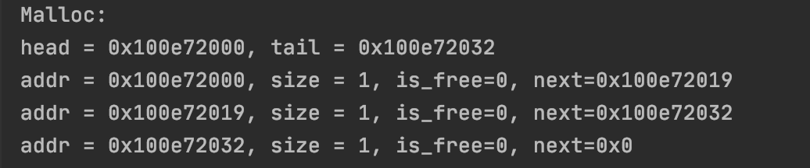
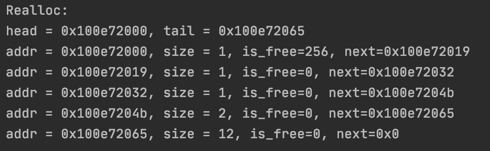
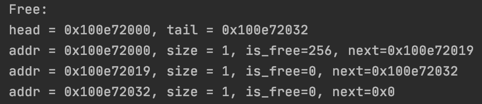

# OS_lab_1: Memory Allocator
## ВАЖНАЯ ЗАМЕТКА
Данная реализация использует sbrk(который нужен для того, чтобы сдвигать указатель на конец кучи), который работает только в unix-системах, поэтому на Windows данная лабораторная работать не будет.
### Описание
Лабораторная работа № 1 заключается в создании аллокатора памяти (в данном примере на С++).
Реализация основана на байтовом массиве с целью изучения и тестирования алгоритма аллокации памяти.
Аллокация памяти предоставляет разработчику контроль над памятью. Это позволяет не только оптимизировать ее использование,
но и улучшить быстродействие программы по сравнению со стандартным сборщиком мусора.
### Описание используемого алгоритма
Эта реализация использует указатели C ++ для перемещения между блоками в памяти.
Каждый блок состоит из двух частей: заголовка и данных.
Размер заголовка постоянный и равен 17 байтам.
Он состоит из 3 полей, в которых хранится информация о том, занят ли блок (1 байт),
размер части данных этого блока (8 байта) и размер предыдущего блока (8 байта).
#### void* memory_allocator(size_t size)
Выполняет поставленную задачу за счет поиска наилучшего решения.
Эта функция выделяет новый блок памяти запрошенного размера.
memory_allocator просматривает всю память, чтобы найти самый маленький пустой блок,
в котором достаточно памяти для выделения нового блока нужного размера.
Этот подход обеспечивает рациональное использование памяти,
чтобы пользователь мог хранить как можно больший объем данных.
#### void* memory_reallocator(void* pointer, size_t size)
Используется, когда вам нужно изменить размер определенного блока памяти.
`pointer` - указатель на блок, размер которого нужно изменить.
`size` - новый размер блока.
##### Поведение
** Если запрошенный размер блока меньше текущего **,
текущий блок будет разделен на две части.
Первая часть размещается и возвращается в результате функции.
Второй также становится блоком, и выполняется операция mem_free,
чтобы освободить блок и объединить его со следующим блоком, если следующий блок пуст.
** Если запрошенный размер блока меньше текущего **, есть два возможных варианта:
- Если следующий блок в сочетании с текущим блоком дает больше места,
 чем достаточно для перераспределения, следующий блок делится на две части.
  Первая часть объединяется с первым блоком для создания нового блока необходимого размера. Вторая часть используется вместо начального второго блока.
- Если второй блок пустой и для его разделения уже не осталось места, эти два блока объединяются.
- если ни один из предыдущих вариантов не был возможен,
новый блок памяти выделяется с помощью `memory_allocator`, а текущий блок очищается.
#### void memory_free (void * addr)
Функция удаляет данные блока, помечает как блок «свободной памяти» и
пытается объединиться с соседними блоками «свободной памяти», если они есть.
### Примеры использования
#### Аллокация 3 блоков по 1 байту
##### Пример кода
```
    malloc(1);
    malloc(1);
    malloc(1);
```
##### Console Output


#### Реаллокация блока 
##### Пример кода
```
    realloc(head->next,12);
```
#### Console Output
##### После Реалока


#### Высвобождение 1-го блока памяти
##### Пример кода
```
free(head->next);
```
#### Console Output
##### После высвобождения

